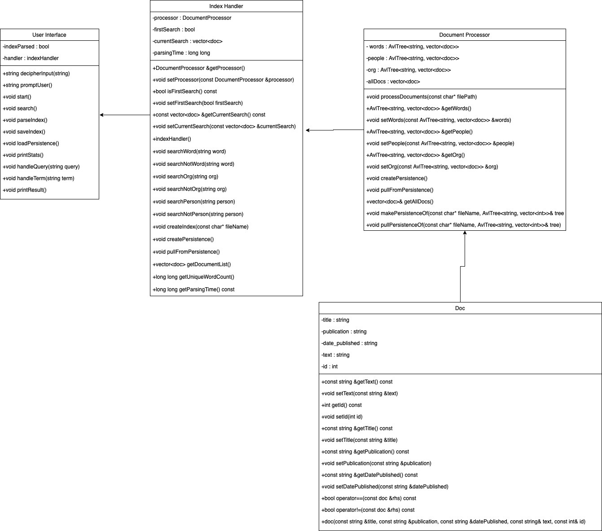
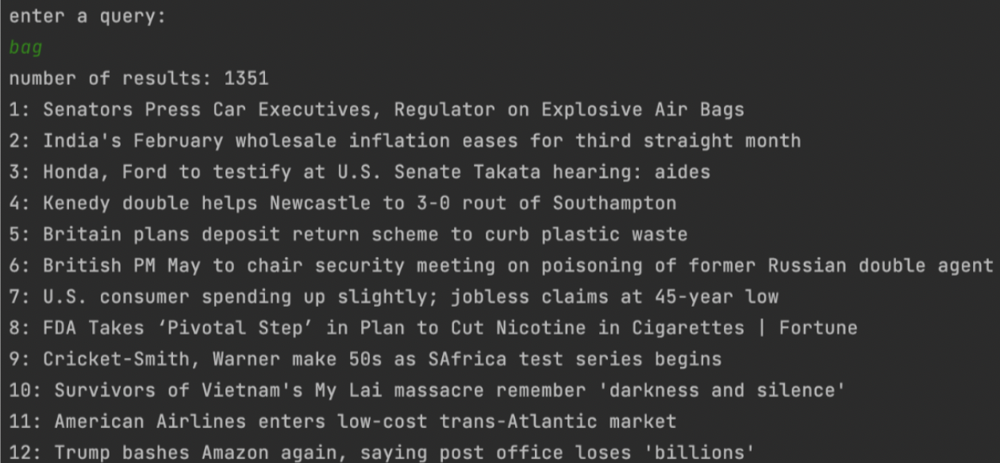
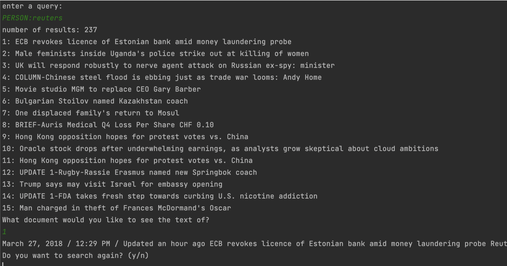
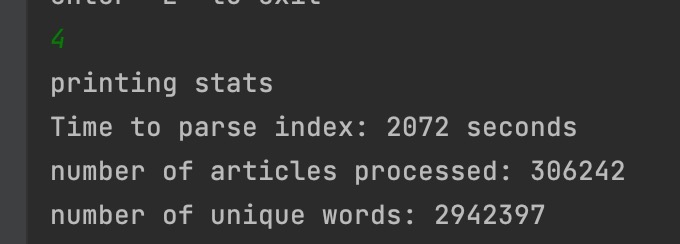

# Updated UML Diagram: 


High-level pseudo code for each component.
- Doc:
  - Container object which holds our title, date, author, id, and text of the document. Has a custom < comparator which we use to sort our relevancy ranking by date.
- Document Processor:
  - Processes documents:
    - Loops through all json files within a directory and its subdirectories
    - Takes all organizations and people, splits them up with their names by spaces, and puts those into the avl tree along with its corresponding document id which they were found in.
    - The same is done for the words, but we loop through the whole text with a stringstream, and then map those words to their corresponding document ids.
  - Persistence:
    - Creates files for words, people, orgs, and allDocuments.
    - Format for words, people, and orgs: Word then all its corresponding id’s.
      - Format for allDocuments:
        - Title, publication, date, id, and whole text on each line
  - Index Handler:
    - Has functions for searching.
    - Each function will call ONE search term and compare that result with any previous searches, only keeping the running list of all common documents.
    - Also calls functions inside the document parser when needed.
  - User Interface:
    - Interprets all user inputs, and calls appropriate functions in the index handler.
    - Splits user’s queries up by spaces and calls appropriate indexHandler functions for those queries.

## Weekly milestones/tasks.

| Task                                               | Planned Completion | Actual Completion | Time Ella | Time Caleb |
|:---------------------------------------------------|-------------------:|------------------:|----------:|-----------:|
| Import and store documents (corpus)                |              Nov 9 |            Nov 10 |         5 |          7 |
| Complete query engine                              |             Nov 12 |            Nov 13 |         4 |          2 |
| Complete all AVL trees and indices                 |             Nov 13 |            Nov 16 |         2 |          4 |
| Integrate query engine and docs into index handler |             Nov 15 |            Nov 27 |         5 |          7 |
| Complete user interface                            |             Nov 17 |            Nov 29 |         2 |          2 |
| Complete Document Parser                           |             Nov 26 |             Dec 1 |         2 |          2 |
| Final tests and add persistence                    |             Nov 29 |             Dec 5 |         6 |          5 |


Explanation of what data structures are used where. For each, state - time and space complexity (Big-Oh), - why it is the appropriate data structure and what other data structure could have been used.
- Vector:
  - Document Processor
    - Keeps a list of all the document objects in the corpus. O(N) insertion
    - Used as the key for each Avl Tree. Was the list of documents which each word was mapped to. O(N) search time.
  - Index Handler
    - Used for the current search attribute. O(N^2) because we had to compare it to each new search inside a double for loop.
    - Is the “running list” of all search terms
  - Alternative
    - Could have used an unordered_set, which has O(1) search time and O(N) insertion time.
- Avl Tree:

  - Document Processor
    - Was the index for words, people, and orgs.
    - Had O(lg(N)) search time and insertion time.
- Alternatives:
  - Could have used a hash map, which has O(1) search time and O(N) insertion time


## How to use the software.
```
Usage:
Index all files in <directory> and store the index in one or several files:
supersearch index <directory>

        Load the existing index and perform the following query:
        supersearch query "social network PERSON:cramer"

        Start a simple text-based user interface that lets the user create an index,
        save/load the index and perform multiple queries:
        supersearch ui
        
```
## Some example queries with the results: 



## Statistics for indexing all documents and timing:


## Testing
- Tests for AVL tree's function
  - We included catch tests for each of the major functions (copy constructor, copy assignment operator, contains, isEmpty, makeEmpty, insert, and get). Refer to test.cpp
- Tests for your AVL tree for memory leaks (don't forget to test the persistence functions)
  - See https://github.com/SMUCS2341/assignment-4-search-engine-pointairs/blob/main/valgrindWithPersistenceAVL.txt
- Tests for indexer
  - See Catch tests in tests.cpp 
- Tests for the complete system
  - See Catch tests in tests.cpp

